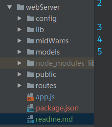

### 使用express+Mongodb的博客系统
Node.js

Express

Mongodb

1. 在目录下新建一下结构文件夹及空文件（其中package.json通过npm init生成）

    

   以上对应文件夹的作用：
    * model: 存放操作数据库的文件
    * public:  存放静态资源，如css、img等
    * routers: 存放路由配置文件
    * views: 存放模板文件
    * package.json: 存储项目名，作者信息，描述信息，项目依赖等信息。
    
2. 安装依赖模块
运行以下命令安装依赖模块

        npm i config-lite connect-flash connect-mongo ejs express express-formidable express-session marked moment mongolass objectid-to-timestamp sha1 winston express-winston --save
    以上各模块的用处：
    * express: web框架
    * express-session: session中间件
    * connect-mongo: 将session存储于mongodb，结合express-session使用
    * connect-flash: 页面通知提示的中间件，基于session实现
    * ejs: 模板
    * express-formidable: 接收表单及文件的上传中间件
    * config-lite: 读取配置文件
    * marked: markdown解析
    * moment: 时间格式化
    * mongolass: mongodb驱动
    * objectid-to-timestamp: 根据ObjectId生成时间戳
    * sha1: sha1加密，用于密码加密
    * winston: 日志
    * express-winston: 基于winston用于express的日志中间件
    
各模块的具体作用在使用过程中详述
    
