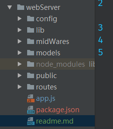

### node+mongodb写一个博客系统
使用了 [express](http://www.expressjs.com.cn/) web服务器组件

mongodb数据库

1. 在目录下新建以下结构文件夹和文件

    
    
以上文件夹对应的作用：
* config放服务器配置文件
* public存放静态资源文件
* routes存放路由配置文件
* package.json项目依赖等信息
* midWare一些中间件
* models数据库操作
2. 项目中的部分依赖
* express：web框架
* express-session:session中间件
* connect-mongo:将session存储于mongodb，结合express-session使用
* mongolass:mongodb驱动
* sha1:密码加密
* config-lite: 加载配置文件(可以自动加载config目录下的default.js文件)

启动文件为app.js，内置注释非常详细，可以按照注释思路往下看